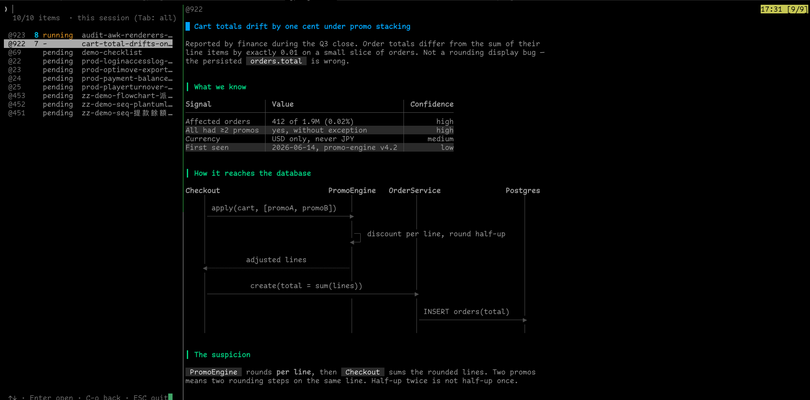
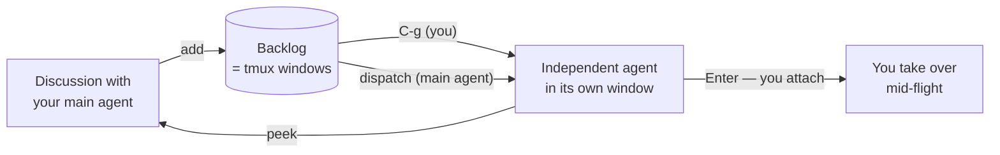

# agent-backlog

**A backlog you and your AI agents share — where every item can be handed to its
own agent and run.**

[繁體中文](README.zh-TW.md) · English

Not a list of reminders. A **dispatch board**: each item carries the prompt that
runs it, and one keystroke turns it into a live Claude Code instance working in its
own tmux window — which you can walk into and take over at any moment.

Items are real notes, so the preview renders them properly: markdown, syntax-
highlighted code, scrollable, CJK-aware — written in awk, with nothing installed.

Zero dependencies. No database, no JSON store, no Node, no Python, no `fzf`, no `jq`.
Just tmux and POSIX tools you already have.



---

## The headline: items are runnable

Every item holds the markdown that describes the work. That same text **is** the
prompt. So an item has two ways to become work in progress:

**You dispatch it.** Select it, press `C-g`. A Claude Code instance starts in that
item's window and receives the item as its prompt. Status flips to `running`.

**Your main agent dispatches it.** Through MCP, the agent you're already talking to
can `list` the backlog, decide what to keep and what to delegate, and `dispatch` the
rest to independent instances — then `peek` at their screens to follow along.



The main agent stays the orchestrator: it triages, keeps what it should do itself,
and farms out the rest. You keep the veto — and the keyboard.

## Why this beats a background task

An agent launched into the background is the agent's own private thing. You can't
see its screen, you can't type into it, and closing your client is awkward.

Here, a dispatched agent runs in **a tmux window like any other**. That means:

- **You can attach.** Press `Enter` and you're in its session, typing to it directly
- **Your agent can look.** `peek` captures the same screen you'd see
- **Status is observed, not recorded.** `list` reports what's actually running in
  that window (`zsh` = not started, otherwise it's working) — queried live from
  tmux, so it can't drift out of sync
- **Nothing is hidden.** Same tool, same window, same keys, for both of you

That symmetry is the whole design: **anything you can do, the agent can do, and
vice versa.**

## The preview renders your markdown

Items are notes you actually wrote — symptoms, log excerpts, a slow query, what to
check. So the preview isn't a plain-text dump:

- **Headings, lists, blockquotes, inline code, horizontal rules**
- **Checklists** — `- [ ]` and `- [x]` render as ☐ / ☑, and an agent can tick them
  off with the `check` tool as it works through the item
- **Fenced code blocks** with keyword-level highlighting for SQL and C#, framed to
  the pane edge. Languages without a lexer (logs, stack traces) pass through
  untouched — which is what you want for them
- **Tables**, column-aligned with `│ ┼` separators, honouring `:---:` / `---:`
  alignment. Widths are computed from *display* width — an East Asian Width table
  lives in the awk, so CJK headers line up. When the table is wider than the pane,
  the widest columns shrink and their cells **wrap inside the column** — padding is
  still applied, so the vertical alignment survives and nothing is lost. Wrapping
  prefers spaces, then `/ ; , .` (so paths and TFM lists break somewhere sensible),
  and treats every CJK character as a break opportunity, which is how Chinese line
  breaking already works. Rows are **zebra-striped**, which is also what keeps a
  wrapped row from blurring into the next one — adjacent rows can never share a shade
- **Scrollable** — one line (`C-e`/`C-y`), half page (`C-d`/`C-u`), full page
  (`C-f`/`C-b`), with tmux's own `[n/m]` position indicator
- **Live** — the list and the preview refresh themselves every few seconds, so you
  watch a dispatched agent tick its checklist off without touching the keyboard
- **CJK-correct.** Wrapping is delegated to tmux's copy-mode, so double-width
  characters land where they should

All of it in **498 lines of awk** with no renderer installed — no `glow`, no `bat`,
no `rich`. Output is byte-for-byte identical across BWK awk (macOS), busybox awk,
and gawk, so it looks the same on your laptop and inside an Alpine container.

## The idea underneath

> **One backlog item *is* one tmux window.**

The window name is the title. The body lives in a tmux window option. That's the
whole data model — the list *is* your window list, filtered.

So an item and *the place where the work happens* are the **same object**. There is
no record pointing at a workspace; there is just the workspace. Pressing `Enter`
doesn't "open a record" — it walks you into the window.

## Why it exists

When you're working with an AI agent, action items surface constantly. You need a
list that **both of you can see**, whose items can be **handed to a separate agent
instance**, and which you can **take over by hand** at any moment.

Claude Code's built-in TodoWrite doesn't do that — it's step-tracking inside a
single session, invisible to you, and nothing in it is runnable. This is the other
thing: work items that outlive the session, that a human can grab, and that live
where the work happens.

## Requirements

- **macOS or Linux** (anything else is refused at load time)
- **tmux ≥ 3.0** — tested on 3.4 and 3.6a

That's it. Uses only `sh` `awk` `sed` `stty` `dd` `od` `cut` `tr` `wc` `grep`
`mkfifo` `mktemp` — all POSIX, all already on your machine.

## Install

### TPM

```tmux
set -g @plugin 'AndyWeiBoan/agent-backlog'
run '~/.tmux/plugins/tpm/tpm'
```

Then `prefix + I`.

> TPM itself needs `bash` and `git`. That's TPM's requirement, not this plugin's —
> the manual route below needs neither.

### Manual

```tmux
run-shell ~/path/to/agent-backlog/agent-backlog.tmux
```

Then `tmux source-file ~/.tmux.conf`.

> `source-file` does **not** remove bindings you deleted from your config.
> If you change keys, `tmux unbind <old-key>` explicitly.

### For your agent (optional)

```sh
claude mcp add agent-backlog -- sh ~/path/to/agent-backlog/scripts/mcp-server.sh
```

The MCP server is **also zero-dependency** — POSIX `sh` + `awk`, including its own
JSON parser. See [How it works](#how-it-works).

## Usage

`prefix + A` opens the list. (Both cases are bound — tmux keys are case sensitive,
and a key bound only as `A` does *nothing at all* when you press `a`, with no error.)

| Key | Action |
|---|---|
| *type* | filter (substring; CJK works) |
| `↑` `↓` | move selection (`C-p` / `C-n` too) |
| `C-e` `C-y` | scroll preview one line |
| `C-d` `C-u` | scroll preview half page |
| `C-f` `C-b` | scroll preview full page |
| `Enter` | switch to that item's window |
| `C-g` | dispatch: start `claude` there and paste the item in |
| `C-t` | cycle status (pending → blocked → done) |
| `C-x` | delete (asks `y`/`n` first) |
| `Tab` | toggle scope: this session ⇄ all sessions |
| `C-r` | reload the list |
| `ESC` `C-c` | leave, returning to where you came from |
| `prefix` + `⌥←` `⌥→` | resize the divider (tmux's own binding; width is remembered) |

Add an item from the shell:

```sh
echo '## Symptoms
KYC thumbnails fail to load in prod, 82 hits in 7d.' \
  | sh scripts/add.sh prod-kyc-thumbnail-missing
```

Back up / restore (items live in tmux server memory — see
[Trade-offs](#trade-offs-and-side-effects)):

```sh
sh scripts/backup.sh              # → ~/agent-backlog-<timestamp>.dump
sh scripts/restore.sh <file>      # skips items that already exist
```

## Configuration

| Option | Default | Meaning |
|---|---|---|
| `@agent_backlog_key` | `A` | key after `prefix` |
| `@agent_backlog_root_key` | — | prefix-less keys, space separated |
| `@agent_backlog_no_key` | — | `on` = bind nothing, do it yourself |
| `@agent_backlog_scope` | `session` | `session` or `global` |
| `@agent_backlog_compat` | — | `on` = also read legacy `@prompt` / `@status` |
| `@agent_backlog_lang` | `en` | `zh-TW` switches the UI to Traditional Chinese |

Want `Ctrl+/` instead of a prefix key:

```tmux
set -g @agent_backlog_root_key 'C-/ C-_'
```

> **Bind both.** With extended keys (CSI u) off, terminals send `0x1F` for
> `Ctrl+/`, which tmux calls `C-_`. Binding only `C-/` does nothing in most
> terminals.

Rolling your own binding — pass `#{session_id}`, `run-shell` expands it at
key-press time:

```tmux
set -g @agent_backlog_no_key on
bind-key -n C-o run-shell "sh #{@agent_backlog_path}/scripts/open.sh '#{session_id}'"
```

## For agents (MCP)

Eight tools — this is what makes the main agent an orchestrator rather than a
note-taker:

| Tool | What the agent does with it |
|---|---|
| `list` | see the whole board, including what is actually running in each window |
| `add` | capture "we should do that" mid-conversation, without derailing |
| `show` | read one item in full before deciding |
| `dispatch` | hand an item to a **separate Claude Code instance** and move on |
| `peek` | capture that instance's screen to follow its progress |
| `check` | tick a checklist item inside an item — `- [ ]` → `- [x]` |
| `append` | write findings back into the item without touching what's there |
| `set_status` | mark blocked / done |

There is deliberately **no `delete`**, and no "replace the whole body" either.
Deleting is a human action, and this system has no version history and no undo —
one bad call must not be able to wipe what you wrote. So agents get **narrow**
writes: `append` can only add, and `check` can only flip `[ ]` ⇄ `[x]`, leaving
every other character alone.

Registering as MCP buys **discoverability**, not capability: a shell script does
the same work, but a fresh Claude Code session has no idea it exists. As an MCP
server, every session loads the tools and their descriptions automatically.

The agent is scoped the same way you are — it derives its own session from the
inherited `TMUX_PANE`. Without that, you'd see 0 items while your agent sees 11,
which breaks the one thing this project is for.

## How it works

**Storage is tmux itself.** Each item is a window carrying two user options:

| Option | Holds |
|---|---|
| `@agent_backlog_prompt` | the raw markdown (also the dispatch prompt) |
| `@agent_backlog_status` | pending / running / blocked / done (any string) |

"Is this an item?" == "does this window have a prompt option?" No sync, no second
source of truth.

**The UI is a window with two panes.** Left: a POSIX-shell loop reading keys with
`stty raw` + `dd`, filtering with `awk`, painting the list. Right: a preview pane
fed through a fifo.

**Scrolling is delegated to tmux.** The preview pane sits in copy-mode; the chooser
just sends `send-keys -X page-down`. Wrapping, East-Asian character widths, and the
`[n/m]` scroll indicator are all tmux's job, so they're correct for free.

**Markdown rendering is 498 lines of awk** (`md.awk`) — headings, lists, inline
code, blockquotes, fenced blocks with keyword-level SQL/C# highlighting. Byte-for-byte
identical output across BWK awk (macOS), busybox awk, and gawk.

**The MCP server speaks JSON-RPC in shell.** Generating JSON is easy (fixed escaping,
UTF-8 passes through). Parsing is the hard part — but only a handful of field paths
matter, so `json_get.awk` is a small tokenizer that flattens one JSON line into
`path<TAB>value`, including `\uXXXX` decoding (some clients escape all non-ASCII;
without decoding, every CJK character becomes `?`).

Roughly 1,500 lines total.

## Trade-offs and side effects

Read this part. Some of these are deliberate, and one of them can lose data.

### Items are not persistent

They live in the tmux server's memory. **Reboot, or `kill-server`, and they are
gone.** Closing an item's window deletes that item — there is no second copy.

Use `scripts/backup.sh` if the content matters. Persistence via
`tmux-resurrect` hooks is planned, not built.

### N items means N windows

Twenty items is twenty idle windows in your window list. That's the cost of making
the item and its workspace the same object. If you keep dozens of long-lived items,
this design will annoy you.

### While the list is open, it takes over your keys

The chooser window sets tmux's `key-table`, which makes it **skip your entire root
key table** (`bind -n ...`). Without that, common bindings like `C-d`, `C-p`, `C-t`
would be intercepted before reaching the list. `prefix` still works normally.

`key-table` is a *session*-level option, so it is saved and restored on exit, and a
hook restores it whenever you switch away to another window. If the chooser is ever
killed in a way that skips cleanup, run `tmux set-option -u key-table`.

### It installs session-level hooks while open

`client-resized`, `client-attached`, `client-detached`, `after-resize-pane`,
`after-select-window`, `window-pane-changed` — all scoped to the session, all
removed on exit. They exist to redraw on resize and to bounce focus out of the
preview pane (which reads no keys, so focus landing there looks like a freeze).

### Dispatch really runs an agent

`C-g` types `claude` into that window and pastes the item as a prompt. It spends
tokens. It needs `claude` on the PATH of *that pane's interactive shell* — not the
tmux server's PATH.

### Scope defaults to per-session

You only see items whose windows live in your current session. `Tab` toggles to
all sessions; `@agent_backlog_scope global` changes the default.

### Not covered

Tables aren't rendered (needs East-Asian width math). Fuzzy matching is substring,
not subsequence. JSON-RPC batching is unsupported. Nothing crosses machines — scope
ends at a single tmux server.

## Migrating from a legacy `@prompt` / `@status` setup

```tmux
set -g @agent_backlog_compat on
```

Compat mode reads the old keys too, and writes status back to whichever key an item
already uses — so both tools see one copy of the data and can't drift apart.

`scripts/migrate.sh` copies old keys to the new namespace (deliberately keeping the
old ones). That produces **two copies**, which will diverge; run it only when you've
decided to move for good.

## Uninstall

```sh
tmux unbind A
tmux kill-window -t '[backlog]' 2>/dev/null
for h in client-resized client-attached client-detached after-resize-pane \
         after-select-window window-pane-changed; do
    tmux set-hook -u "$h"
done
tmux set-option -u key-table
```

Your items are windows; keeping or closing them is up to you.

## Documentation

Design rationale, research results, and a long list of things that bit us during
development live in [docs/](docs/). Implementation details:
[docs/07-implementation.md](docs/07-implementation.md).

## License

MIT
