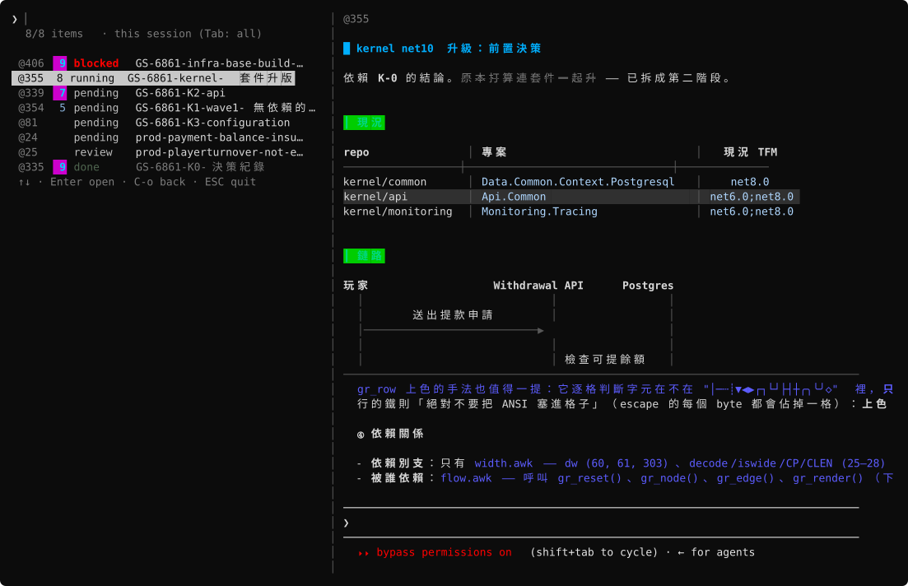
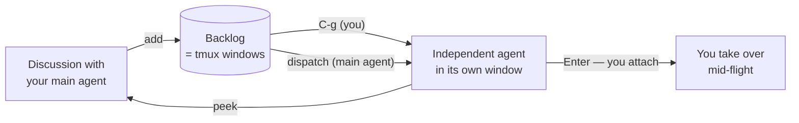

# agent-backlog

**A backlog you and your AI agents share — where every item can be handed to its
own agent and run.**

[繁體中文](README.zh-TW.md) · English

Not a list of reminders. A **dispatch board**: each item carries the prompt that
runs it, and one keystroke turns it into a live Claude Code instance working in its
own tmux window — which you can walk into and take over at any moment.

Items are real notes, so the preview renders them properly: markdown, syntax-
highlighted code, scrollable, CJK-aware — written in awk, with nothing installed.

Zero dependencies. No database, no JSON store, no Node, no Python, no `fzf`, no `jq`.
Just tmux and POSIX tools you already have.



<sub>Not a screenshot — the SVG is generated from the real output of `list.awk` and
`md.awk` (`tools/make-assets.sh`), so every glyph sits exactly where the terminal
puts it. Regenerate it after changing a renderer.</sub>

---

## The headline: items are runnable

Every item holds the markdown that describes the work. That same text **is** the
prompt. So an item has two ways to become work in progress:

**You dispatch it.** Select it, press `C-g`. A Claude Code instance starts in that
item's window and receives the item as its prompt. Status flips to `running`.

**Your main agent dispatches it.** Through MCP, the agent you're already talking to
can `list` the backlog, decide what to keep and what to delegate, and `dispatch` the
rest to independent instances — then `peek` at their screens to follow along.



The main agent stays the orchestrator: it triages, keeps what it should do itself,
and farms out the rest. You keep the veto — and the keyboard.

## Why this beats a background task

An agent launched into the background is the agent's own private thing. You can't
see its screen, you can't type into it, and closing your client is awkward.

Here, a dispatched agent runs in **a tmux window like any other**. That means:

- **You can attach.** Press `Enter` and you're in its session, typing to it directly
- **Your agent can look.** `peek` captures the same screen you'd see
- **Status is observed, not recorded.** `list` reports what's actually running in
  that window (`zsh` = not started, otherwise it's working) — queried live from
  tmux, so it can't drift out of sync
- **Nothing is hidden.** Same tool, same window, same keys, for both of you

That symmetry is the whole design: **anything you can do, the agent can do, and
vice versa.**

## The preview renders your markdown

Items are notes you actually wrote — symptoms, log excerpts, a slow query, what to
check. So the preview isn't a plain-text dump:

- **Headings, lists, blockquotes, inline code, horizontal rules**
- **Bold** and **strikethrough** (`~~like this~~`), in any nesting or overlap — one
  left-to-right pass with two toggles, so `~~**x**~~` and `**~~x~~**` both work.
  Strikethrough is emitted as dim + SGR 9, so a terminal that ignores SGR 9 still
  shows the text dimmed instead of showing nothing at all
- **Checklists** — `- [ ]` and `- [x]` render as ⬜ / ✅ (emoji-presentation glyphs,
  which fill the cell — unlike the thin ☐ ☑), and an agent can tick them off with the
  `check` tool as it works through the item
- **Fenced code blocks** with keyword-level highlighting for SQL and C#, framed to
  the pane edge. Languages without a lexer (logs, stack traces) pass through
  untouched — which is what you want for them
- **Diagrams** — a ```` ```mermaid ```` (or ```` ```plantuml ````) fence renders as an
  actual diagram, in awk:
  - `sequenceDiagram` / PlantUML messages — lifelines, arrows, dashed replies,
    self-message loops
  - `flowchart` / `graph` — Sugiyama layering with cycle breaking and dummy nodes for
    long edges; parallel edges merge their labels, back edges become footnotes

  Both are CJK-width-correct. Anything else (`erDiagram`, `C4Context`, `gantt`, `pie`, …)
  falls back to a plain code block, so the worst case is what you see today
- **Tables**, column-aligned with `│ ┼` separators, honouring `:---:` / `---:`
  alignment. Widths are computed from *display* width — an East Asian Width table
  lives in the awk, so CJK headers line up. When the table is wider than the pane,
  the widest columns shrink and their cells **wrap inside the column** — padding is
  still applied, so the vertical alignment survives and nothing is lost. Wrapping
  prefers spaces, then `/ ; , .` (so paths and TFM lists break somewhere sensible),
  and treats every CJK character as a break opportunity, which is how Chinese line
  breaking already works. Rows are **zebra-striped**, which is also what keeps a
  wrapped row from blurring into the next one — adjacent rows can never share a shade
- **Scrollable** — one line (`C-e`/`C-y`), half page (`C-d`/`C-u`), full page
  (`C-f`/`C-b`), with tmux's own `[n/m]` position indicator
- **Live** — the list and the preview refresh themselves every few seconds, so you
  watch a dispatched agent tick its checklist off without touching the keyboard
- **CJK-correct.** Wrapping is delegated to tmux's copy-mode, so double-width
  characters land where they should

All of it in **1,607 lines of awk** with no renderer installed — no `glow`, no `bat`,
no `rich`. Output is byte-for-byte identical across BWK awk (macOS), busybox awk,
and gawk, so it looks the same on your laptop and inside an Alpine container.

## The idea underneath

> **One backlog item *is* one tmux window.**

The window name is the title. The body lives in a tmux window option. That's the
whole data model — the list *is* your window list, filtered.

So an item and *the place where the work happens* are the **same object**. There is
no record pointing at a workspace; there is just the workspace. Pressing `Enter`
doesn't "open a record" — it walks you into the window.

## Why it exists

When you're working with an AI agent, action items surface constantly. You need a
list that **both of you can see**, whose items can be **handed to a separate agent
instance**, and which you can **take over by hand** at any moment.

Claude Code's built-in TodoWrite doesn't do that — it's step-tracking inside a
single session, invisible to you, and nothing in it is runnable. This is the other
thing: work items that outlive the session, that a human can grab, and that live
where the work happens.

## Requirements

- **macOS or Linux** (anything else is refused at load time)
- **tmux ≥ 3.0** — tested on 3.4 and 3.6a

That's it. Uses only `sh` `awk` `sed` `stty` `dd` `od` `cut` `tr` `wc` `grep` `sort`
`date` `dirname` `cat` `rm` `mkfifo` `mktemp` — all POSIX, all already on your machine.

> `tools/` holds a Python script that regenerates the README image. It is a
> documentation tool — the plugin never runs it, and Python is not a dependency.

## Install

### TPM

```tmux
set -g @plugin 'AndyWeiBoan/agent-backlog'
run '~/.tmux/plugins/tpm/tpm'
```

Then `prefix + I`.

> TPM itself needs `bash` and `git`. That's TPM's requirement, not this plugin's —
> the manual route below needs neither.

### Manual

```tmux
run-shell ~/path/to/agent-backlog/agent-backlog.tmux
```

Then `tmux source-file ~/.tmux.conf`.

> `source-file` does **not** remove bindings you deleted from your config.
> If you change keys, `tmux unbind <old-key>` explicitly.

### For your agent (optional)

```sh
claude mcp add agent-backlog -- sh ~/path/to/agent-backlog/scripts/mcp-server.sh
```

The MCP server is **also zero-dependency** — POSIX `sh` + `awk`, including its own
JSON parser. See [How it works](#how-it-works).

## Usage

`prefix + A` opens the list. (Both cases are bound — tmux keys are case sensitive,
and a key bound only as `A` does *nothing at all* when you press `a`, with no error.)

| Key | Action |
|---|---|
| *type* | filter (substring; CJK works). Matches the window_id too — when an agent says "@355", type `355` |
| `↑` `↓` | move selection (`C-p` / `C-n` too) |
| `C-e` `C-y` | scroll preview one line |
| `C-d` `C-u` | scroll preview half page |
| `C-f` `C-b` | scroll preview full page |
| `Enter` | switch to that item's window |
| `C-g` | dispatch: run `@agent_backlog_dispatch_cmd` there and paste the item in |
| `C-t` | cycle status (pending → blocked → done) |
| `C-k` `C-j` | raise / lower priority (1–10, default 1) |
| `C-x` | delete (asks `y`/`n` first; stashes to a tmux buffer before killing) |
| `Tab` | toggle scope: this session ⇄ all sessions |
| `C-r` | reload the list |
| `ESC` `C-c` | leave, returning to where you came from |
| `C-o` | leave to your workspace — the last non-item window you opened the menu from, or this session's first non-item window if there is no such record |
| `prefix` + `⌥←` `⌥→` | resize the divider (tmux's own binding; width is remembered) |

Every row starts with the item's **`window_id`** (`@355`), dimmed, and the preview
repeats it on its first line. Agents refer to items by that id in conversation
("@355 flags itself as the biggest unknown") — without it on screen you cannot tell
which item they mean. The id column is only as wide as the longest id, and its width
is computed over every item rather than the matches, so it does not jitter as you type.

Add an item from the shell:

```sh
echo '## Symptoms
KYC thumbnails fail to load in prod, 82 hits in 7d.' \
  | sh scripts/add.sh prod-kyc-thumbnail-missing
```

Back up / restore (items live in tmux server memory — see
[Trade-offs](#trade-offs-and-side-effects)):

```sh
sh scripts/backup.sh                     # → ~/agent-backlog-<timestamp>.dump
sh scripts/restore.sh <file> [session]   # skips items that already exist
```

> `restore.sh` prints which session it is restoring into. Without an argument it
> uses the current session — and when run from a script or another session, "current"
> is not necessarily the one you meant.

## How the list is ordered

Not by window creation order. By these three keys:

1. **`done` sinks to the bottom** — a finished item is noise, but deleting it is a
   separate decision. Sinking keeps the board tidy while leaving it there to look back at
2. **Priority, descending** — `C-k` / `C-j`, 1–10, default 1
3. **Title, ascending** — because how you name things already carries the intent.
   Numbered items (`GS-6861-K0 K1 K2 …`) sort correctly with nothing else marked;
   window order gives you `K2 K9 K3` instead, because K9 was created before K3

**You and your agent see the same order** — the sort lives in `ab_items()`, and the
chooser, the MCP `list`, and `backup` all go through it.

**tmux's own window order is kept in sync too** — the status bar, `C-b w` and
`prefix + <number>` show the same sequence as the list. Any change to priority or
status re-syncs it (`swap-window -d`), so whichever door you come in through, the
order is the same.

Only indexes already occupied by backlog items are swapped, so **no non-backlog
window ever moves** (your shell, a running claude, the chooser itself), and gaps in
the numbering are preserved.

### Colour

The two columns sit side by side, so each gets its own hue family and they never
compete:

- **Priority is blue**, with brightness for magnitude: 7–10 bold bright cyan, 2–6 soft
  blue, 1 not printed at all
- **Status is semantic**, roughly "how much does this need you":
  `blocked` bold red › `running` orange › `pending` light grey › `done` dim green (which
  dims the title too)

Status is an arbitrary string; anything custom (say `review`) falls back to light grey.

## Configuration

| Option | Default | Meaning |
|---|---|---|
| `@agent_backlog_key` | `A` | key after `prefix` |
| `@agent_backlog_root_key` | — | prefix-less keys, space separated |
| `@agent_backlog_no_key` | — | `on` = bind nothing, do it yourself |
| `@agent_backlog_scope` | `session` | `session` or `global` |
| `@agent_backlog_compat` | — | `on` = also read legacy `@prompt` / `@status` |
| `@agent_backlog_lang` | `en` | `zh-TW` switches the UI to Traditional Chinese |
| `@agent_backlog_dispatch_cmd` | `claude` | the command typed into the window on dispatch |

### Dispatching without permission prompts

After `C-g`, Claude Code stops and asks `Do you want to proceed?` by default — which
means walking into every window to press Yes, defeating the point of dispatching. To
skip the prompts:

```tmux
set -g @agent_backlog_dispatch_cmd 'claude --permission-mode bypassPermissions'
```

> **Not the default, deliberately.** `bypassPermissions` lets a dispatched agent do
> anything in that directory unattended — delete files, `git push`, reach the network,
> no questions asked. That is your call to make, not a plugin's default.
>
> For a middle ground, `acceptEdits` auto-approves file edits only. Full list:
> `claude --help`, under `--permission-mode`.

The same option is how you swap the agent — `codex`, `opencode`, `pi` all work the
same way. The plugin should not pick one for you.

### Letting a dispatched agent consult a stronger model

Claude Code has an `--advisor` flag that is not listed in `--help` (`/advisor`
interactively, `advisorModel` in settings): the executing model can hand the whole
transcript to a stronger advisor model and get strategic guidance before continuing.
Dispatch is exactly its case — nobody is watching those windows, so a wrong turn early
stays wrong.

```tmux
set -g @agent_backlog_dispatch_cmd 'claude --permission-mode bypassPermissions --advisor fable'
```

> The executing model decides when to consult, not every turn — for work with nothing
> to plan it usually never does.
>
> The advisor model is validated. Name one that cannot act as an advisor and `claude`
> refuses to start at all (`The model "…" cannot be used as an advisor.`), and dispatch
> reports that it did not come up.

Want `Ctrl+/` instead of a prefix key:

```tmux
set -g @agent_backlog_root_key 'C-/ C-_'
```

> **Bind both.** With extended keys (CSI u) off, terminals send `0x1F` for
> `Ctrl+/`, which tmux calls `C-_`. Binding only `C-/` does nothing in most
> terminals.

Rolling your own binding — pass `#{session_id}`, `run-shell` expands it at
key-press time:

```tmux
set -g @agent_backlog_no_key on
bind-key -n C-o run-shell "sh #{@agent_backlog_path}/scripts/open.sh '#{session_id}'"
```

## For agents (MCP)

Ten tools — this is what makes the main agent an orchestrator rather than a
note-taker:

| Tool | What the agent does with it |
|---|---|
| `list` | see the whole board, including what is actually running in each window |
| `add` | capture "we should do that" mid-conversation, without derailing |
| `show` | read one item in full before deciding |
| `dispatch` | hand an item to a **separate Claude Code instance** and move on |
| `peek` | capture that instance's screen to follow its progress |
| `check` | tick a checklist item inside an item — `- [ ]` → `- [x]` |
| `append` | write findings back into the item without touching what's there — its description says explicitly not to use it for progress narration |
| `set_status` | mark blocked / done — a `done` item sinks to the bottom of the list |
| `set_priority` | float something to the top (1–10) — same ordering the human sees |
| `delete` | remove one named item — heavily fenced, see below |

**The description is the only place you can constrain an agent.** There is no
permission system here and no review step — the agent does whatever it read. So every
writing tool (`add` / `append` / `check` / `delete`) spells out **when not to use it**,
not just how.

`append` needs it most: it is the only operation that makes an item grow without
bound, and the body cannot be rewritten. An agent using it for progress narration
("I read A", "I tried B") turns the item into a running log, which buries the point.
So its description makes the agent ask three things first — is this already written?
could `check` express it instead? will this change what the human decides?

There is deliberately **no "replace the whole body"** and **no batch delete**. This
system has no version history and no undo — one bad call must not be able to wipe
what you wrote. So agents get **narrow** writes: `append` can only add, and `check`
can only flip `[ ]` ⇄ `[x]`, leaving every other character alone.

`delete` exists, but it is fenced in:

- **One item per call, and `target` is required.** No wildcards, no `clear`, no
  "delete everything that's done". Emptying the board means the agent naming every
  single item out loud
- **The whole item is stashed into the tmux buffer `agent_backlog_deleted` first**
  (same format as a `backup.sh` dump), so there is one chance to undo:

  ```sh
  tmux show-buffer -b agent_backlog_deleted > /tmp/x
  sh scripts/restore.sh /tmp/x
  ```

  Only the most recent deletion is kept (the named buffer is overwritten). This is
  not a backup mechanism; it's one chance after a slip
- **Refused if something is running in that window** — including a dispatched claude
  still working, and including a `vim` you left open. Overriding needs
  `force: true`, which kills that process
- The tool description tells the agent explicitly: when unsure whether something
  should stay, mark it `done` with `set_status` and let the human decide

The human's `C-x` stashes before deleting too — one wrong `y` has no second chance,
and that line costs essentially nothing.

Registering as MCP buys **discoverability**, not capability: a shell script does
the same work, but a fresh Claude Code session has no idea it exists. As an MCP
server, every session loads the tools and their descriptions automatically.

The agent is scoped the same way you are — it derives its own session from the
inherited `TMUX_PANE`. Without that, you'd see 0 items while your agent sees 11,
which breaks the one thing this project is for.

## How it works

**Storage is tmux itself.** Each item is a window carrying three user options:

| Option | Holds |
|---|---|
| `@agent_backlog_prompt` | the raw markdown (also the dispatch prompt) |
| `@agent_backlog_status` | pending / running / blocked / done (any string) |
| `@agent_backlog_priority` | 1–10, higher first. Absent = 1 |

"Is this an item?" == "does this window have a prompt option?" No sync, no second
source of truth.

**The UI is a window with two panes.** Left: a POSIX-shell loop reading keys with
`stty raw` + `dd`, filtering with `awk`, painting the list. Right: a preview pane
fed through a fifo.

**Scrolling is delegated to tmux.** The preview pane sits in copy-mode; the chooser
just sends `send-keys -X page-down`. Wrapping, East-Asian character widths, and the
`[n/m]` scroll indicator are all tmux's job, so they're correct for free.

**Markdown rendering is 1,607 lines of awk** (`md.awk` plus `width.awk` `graph.awk` `seq.awk` `flow.awk`) — headings, lists, inline
code, blockquotes, fenced blocks with keyword-level SQL/C# highlighting. Byte-for-byte
identical output across BWK awk (macOS), busybox awk, and gawk.

**The MCP server speaks JSON-RPC in shell.** Generating JSON is easy (fixed escaping,
UTF-8 passes through). Parsing is the hard part — but only a handful of field paths
matter, so `json_get.awk` is a small tokenizer that flattens one JSON line into
`path<TAB>value`, including `\uXXXX` decoding (some clients escape all non-ASCII;
without decoding, every CJK character becomes `?`).

Roughly 3,100 lines total.

## Trade-offs and side effects

Read this part. Some of these are deliberate, and one of them can lose data.

### Items are not persistent

They live in the tmux server's memory. **Reboot, or `kill-server`, and they are
gone.** Closing an item's window deletes that item — there is no second copy.

Use `scripts/backup.sh` if the content matters. Persistence via
`tmux-resurrect` hooks is planned, not built.

Three fields vanish together: body, status, priority. `backup.sh` carries all three
(the `@@ITEM2` format) — but **older dumps (`@@ITEM`) have no priority field, so a
restore from one flattens every priority back to 1**.

### The title is a sort key

The list falls back to title order, so renaming a window with tmux's `,` **moves that
item in the list** (and renumbers windows along with it). The window name used to be
just a label; now it is part of the interface.

CJK titles sort by **UTF-8 bytes** — not stroke count, not pinyin — and all ASCII
sorts before all CJK. Numbered schemes like `GS-6861-K*` are unaffected, but a title
starting with CJK will land somewhere that looks arbitrary to a human.

### Your agent can rearrange your windows

One MCP `set_priority` or `set_status` reorders the backlog windows in that session.
That is the price of keeping both orders in sync, but state it plainly: **it is a real
power handed to the agent.**

### Sinking `done` makes accumulated junk less visible

Sinking keeps the board looking clean, but twenty done items are still twenty windows
sitting at the bottom. It lowers your motivation to clear them — and since `delete` takes one named item at
a time, clearing a pile of done items is still your job in practice.

### Under `scope=global` the two orders will not match

The list interleaves sessions; the window reorder happens within each session. So a
global-scope list order matches no single session's window order. Not a bug — the two
things are defined over different sets.

### Changing priority or status costs 26–51ms

Those keys (`C-k` `C-j` `C-t`) do an extra window-order sync: two window listings, a
permutation, and at most one batched tmux call. Arrow keys and filtering are unaffected.

### N items means N windows

Twenty items is twenty idle windows in your window list. That's the cost of making
the item and its workspace the same object. If you keep dozens of long-lived items,
this design will annoy you.

### Changing priority or status renumbers your windows

To keep tmux's window order matching the list, a change triggers `swap-window -d`.
**Backlog window indexes move**, so `prefix + <number>` is not a stable handle for a
given item. Non-backlog windows never move, and the item you're currently looking at
isn't swapped out from under you — tmux tracks the current window *by index*, so the
original window is recorded and re-selected once the swaps are done.

If you arrange your windows by hand, this will override that arrangement.

### While the list is open, it takes over your keys

The chooser window sets tmux's `key-table`, which makes it **skip your entire root
key table** (`bind -n ...`). Without that, common bindings like `C-d`, `C-p`, `C-t`
would be intercepted before reaching the list. `prefix` still works normally.

`key-table` is a *session*-level option, so it is saved and restored on exit, and a
hook restores it whenever you switch away to another window. If the chooser is ever
killed in a way that skips cleanup, run `tmux set-option -u key-table`.

### It installs session-level hooks while open

`client-resized`, `client-attached`, `client-detached`, `after-resize-pane`,
`after-select-window`, `window-pane-changed` — all scoped to the session, all
removed on exit. They exist to redraw on resize and to bounce focus out of the
preview pane (which reads no keys, so focus landing there looks like a freeze).

### Dispatch really runs an agent

`C-g` types `claude` into that window and pastes the item as a prompt. It spends
tokens. It needs `claude` on the PATH of *that pane's interactive shell* — not the
tmux server's PATH.

### Scope defaults to per-session

You only see items whose windows live in your current session. `Tab` toggles to
all sessions; `@agent_backlog_scope global` changes the default.

### Not covered

Tables aren't rendered (needs East-Asian width math). Fuzzy matching is substring,
not subsequence. JSON-RPC batching is unsupported. Nothing crosses machines — scope
ends at a single tmux server.

## Migrating from a legacy `@prompt` / `@status` setup

```tmux
set -g @agent_backlog_compat on
```

Compat mode reads the old keys too, and writes status back to whichever key an item
already uses — so both tools see one copy of the data and can't drift apart.

`scripts/migrate.sh` copies old keys to the new namespace (deliberately keeping the
old ones). That produces **two copies**, which will diverge; run it only when you've
decided to move for good.

## Uninstall

```sh
tmux unbind A
tmux kill-window -t '[backlog]' 2>/dev/null
for h in client-resized client-attached client-detached after-resize-pane \
         after-select-window window-pane-changed; do
    tmux set-hook -u "$h"
done
tmux set-option -u key-table
```

Your items are windows; keeping or closing them is up to you.

## Documentation

Read [docs/architecture.md](docs/architecture.md) before touching the code — a file
map, **twelve rules you must not break** (each one maps to something that actually
broke), and what to verify after a change.

It describes only the current state. The earlier research and planning notes (the old
Node implementation, the fzf evaluation, the roadmap) no longer hold, so they are gone
— they are still in the git history if you want them.

## License

MIT
