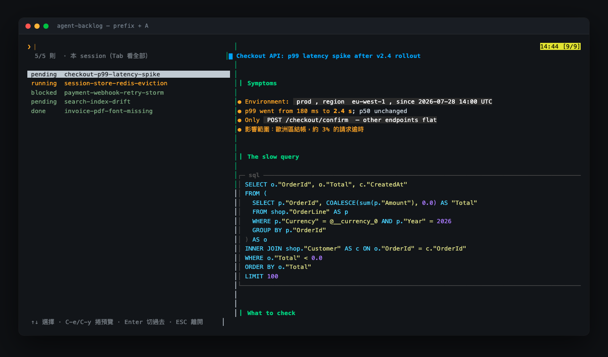
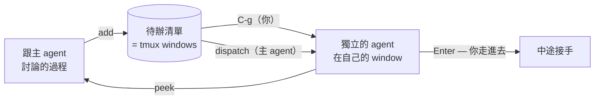

# agent-backlog

**人與 AI agent 共享的待辦清單 —— 每一則都能交給一個獨立的 agent 去執行。**

繁體中文 · [English](README.md)

> 介面預設是英文。要中文請設 `set -g @agent_backlog_lang zh-TW`（下圖就是中文版）。

這不是一份提醒事項，是一塊**派工板**：每一則待辦本身就帶著執行它的 prompt，
按一個鍵就變成一個活著的 Claude Code 實例，在它自己的 tmux window 裡工作 ——
而你隨時可以走進去接手。

待辦是你真的寫下的筆記，所以預覽會好好 render：markdown、語法高亮的程式碼、
可捲動、中文寬度正確 —— 全部用 awk 寫，不用裝任何東西。

零依賴。沒有資料庫、沒有 JSON 檔、沒有 Node、沒有 Python、不需要 `fzf`、不需要 `jq`。
只用 tmux 和你機器上本來就有的 POSIX 工具。



---

## 最大的賣點：待辦是可以執行的

每一則待辦裝的是描述這件事的 markdown。那段文字**本身就是 prompt**。
所以一則待辦有兩條路變成正在進行的工作：

**你自己派。** 選中它，按 `C-g`。一個 Claude Code 實例在那則待辦的 window 裡啟動，
並收到待辦內容當 prompt，狀態轉成 `running`。

**主 agent 幫你派。** 透過 MCP，你正在對話的那個 agent 可以 `list` 掌握全局、
決定哪些自己做、哪些交出去，把其餘的 `dispatch` 給獨立實例，
再用 `peek` 看它們的畫面追進度。



主 agent 是統籌者：它分類、留下該自己做的、把其餘的派出去。
否決權和鍵盤都還在你手上。

## 為什麼這比背景任務好

丟到背景執行的 agent 是 agent 自己的私有物。你看不到它的畫面、打不了字進去，
關掉 client 也很麻煩。

在這裡，被派工的 agent 跑在**一個跟其他 window 沒兩樣的 tmux window** 裡：

- **你可以走進去。** 按 `Enter` 就在它的 session 裡，直接跟它對話
- **agent 也看得到。** `peek` 抓的就是你會看到的同一個畫面
- **狀態是觀察來的，不是記錄的。** `list` 回報那個 window 裡實際在跑什麼
  （`zsh` = 還沒開始，否則就是在做事）—— 即時查 tmux，不可能脫節
- **沒有隱藏的東西。** 同一個工具、同一個 window、同一組鍵，你和它共用

這個對稱性就是整個設計：**你能做的 agent 也能做，反之亦然。**

## 預覽會 render 你的 markdown

待辦是你真的寫下的東西 —— 現象、log 片段、一段慢查詢、要查什麼。
所以預覽不是純文字傾印：

- **標題、清單、引用、行內程式碼、水平線**
- **checklist** —— `- [ ]` 與 `- [x]` render 成 ⬜ / ✅ —— 用 emoji-presentation 的字形，
  會把字元格填滿，不像 ☐ ☑ 又小又細。agent 邊做可以邊用 `check` 工具打勾
- **code block** 帶 SQL 與 C# 的關鍵字級高亮，框線畫到窗格邊緣。
  沒有 lexer 的語言（log、stack trace）原樣輸出 —— 那本來就不該上色
- **表格**對齊分欄（`│ ┼`），支援 `:---:` 與 `---:` 的對齊宣告。
  欄寬按**顯示寬度**計算 —— East Asian Width 表就寫在 awk 裡，所以中文表頭對得齊。
  比窗格寬的時候，最寬的欄會縮，而 cell 內容**在欄內折行**（補白照補，
  所以垂直對齊保留，內容一個字都不會少）。斷行優先找空白，其次是 `/ ; , .`
  （長路徑和 TFM 串才會斷在有意義的地方），中文則逐字可斷 —— 那本來就是中文的斷行規則。
  列是**斑馬紋**（隔列鋪底色），這同時解決了「折行的列會黏成一團」——
  相鄰兩列的底色必定不同，不需要另外畫線去分開它們
- **可捲動** —— 一行（`C-e`/`C-y`）、半頁（`C-d`/`C-u`）、整頁（`C-f`/`C-b`），
  附 tmux 自己的 `[n/m]` 位置指示器
- **會自己更新** —— 清單與預覽每幾秒自動比對一次，所以派工出去的 agent
  把 checklist 一項項勾掉時，你不用碰鍵盤就看得到
- **中文寬度正確。** 折行交給 tmux 的 copy-mode，雙寬字元不會跑位

全部是 **520 行 awk**，不需要安裝任何 renderer —— 不用 `glow`、不用 `bat`、
不用 `rich`。在 BWK awk（macOS）、busybox awk、gawk 三種實作下輸出**逐位元組相同**，
所以在你的筆電和 Alpine 容器裡長得一模一樣。

## 底層的想法

> **一則待辦，就是一個 tmux window。**

window 名稱是標題，內容存在 window 的 option 上。整個資料模型就這樣 ——
清單**就是**你的 window 列表，只是濾過。

所以「待辦」和「執行它的地方」是**同一個物件**。不是一筆記錄指向某個工作區，
而是根本就沒有記錄，只有工作區本身。按 `Enter` 不是「打開一筆記錄」，
是走進那個 window。

## 為什麼需要它

跟 AI agent 一起工作時，待辦事項會不斷冒出來。你需要一份**兩邊都看得到**的清單，
裡面的項目可以**交給獨立的 agent 實例執行**，而且你隨時能**親手接手**。

Claude Code 內建的 TodoWrite 做不到 —— 那是單一 session 內的步驟追蹤，你看不到，
而且裡面沒有任何東西是可執行的。這是另一種東西：活得比 session 久、人抓得到、
而且長在工作發生的地方。

## 需求

- **macOS 或 Linux**（其他平台在載入時就會被擋下）
- **tmux 3.0 以上** —— 實測過 3.4 與 3.6a

就這樣。只用到 `sh` `awk` `sed` `stty` `dd` `od` `cut` `tr` `wc` `grep` `sort`
`date` `dirname` `cat` `rm` `mkfifo` `mktemp` —— 全是 POSIX，你的機器上都有。

## 安裝

### TPM

```tmux
set -g @plugin 'AndyWeiBoan/agent-backlog'
run '~/.tmux/plugins/tpm/tpm'
```

然後 `prefix + I`。

> TPM 自己需要 `bash` 和 `git`。那是 TPM 的依賴，不是本 plugin 的 ——
> 下面「手動」那條路兩個都不需要。

### 手動

```tmux
run-shell ~/path/to/agent-backlog/agent-backlog.tmux
```

然後 `tmux source-file ~/.tmux.conf`。

> `source-file` **不會**移除你已經從設定檔刪掉的 binding。
> 換鍵的話要自己 `tmux unbind <舊鍵>`。

### 給 agent 用（選配）

```sh
claude mcp add agent-backlog -- sh ~/path/to/agent-backlog/scripts/mcp-server.sh
```

MCP server **也是零依賴的** —— POSIX `sh` + `awk`，連 JSON 解析器都是自己寫的。
細節見[運作方式](#運作方式)。

## 用法

`prefix + A` 開清單。（大小寫都綁了 —— tmux 的鍵區分大小寫，只綁 `A` 的話
按 `a` **完全不會有任何反應**，而且沒有錯誤訊息。）

| 鍵 | 動作 |
|---|---|
| *打字* | 篩選（子字串比對，中文可用） |
| `↑` `↓` | 移動選擇（`C-p` / `C-n` 同） |
| `C-e` `C-y` | 預覽捲一行 |
| `C-d` `C-u` | 預覽捲半頁 |
| `C-f` `C-b` | 預覽捲整頁 |
| `Enter` | 切到該待辦的 window |
| `C-g` | 派工：在那裡啟動 `claude` 並把內容貼進去 |
| `C-t` | 輪替狀態（pending → blocked → done） |
| `C-k` `C-j` | 優先度 +1 / -1（1–10，預設 1） |
| `C-x` | 刪除（先問 `y`/`n`，刪前會 stash 到 tmux buffer） |
| `Tab` | 切換範圍：本 session ⇄ 全部 session |
| `C-r` | 重新讀取清單 |
| `ESC` `C-c` | 離開，回到開清單之前的位置 |
| `prefix` + `⌥←` `⌥→` | 調整中間分隔線（tmux 原生綁定，寬度會記住） |

從 shell 新增一則：

```sh
echo '## 現象
prod 上 KYC 縮圖開不出來，7d 82 筆。' \
  | sh scripts/add.sh prod-kyc-thumbnail-missing
```

備份／還原（待辦活在 tmux server 記憶體裡，見[取捨與副作用](#取捨與副作用)）：

```sh
sh scripts/backup.sh                      # → ~/agent-backlog-<時間>.dump
sh scripts/restore.sh <檔名> [session]     # 同名的會跳過，不覆蓋
```

> `restore.sh` 會印出它要還原到哪個 session。不指定的話用當前 session ——
> 從 script 或別的 session 跑起來時，「當前」不一定是你以為的那個。

## 清單順序

清單不是照 window 建立順序排的，是照這三個鍵：

1. **`done` 沉底** —— 做完的是噪音，但刪掉它是另一個決定。沉底讓板子自己保持乾淨，
   而你想回頭看它還在
2. **優先度降冪** —— `C-k` / `C-j` 調，1–10，預設 1
3. **標題升冪** —— 因為命名本來就帶著意圖。`GS-6861-K0 K1 K2 …` 這種編號不用
   另外標任何東西就會排對；照 window 順序反而會出現 `K2 K9 K3`（K9 比 K3 早建）

**人和 agent 看到同一個順序** —— 排序寫在 `ab_items()` 裡，選單、MCP 的 `list`、
`backup` 全部走那一支。

而且 **tmux 自己的 window 順序也會跟著對齊** —— 狀態列、`C-b w`、`prefix + 數字`
看到的先後跟清單一致。優先度或狀態一改就同步一次（`swap-window -d`），
所以「從哪個門進來」都是同一個順序。

只在待辦佔住的那些 window index 之間互換，**非待辦的 window 一個都不會動**
（你的 shell、正在跑的 claude、選單自己），index 的空缺也維持原樣。

## 設定

| option | 預設 | 說明 |
|---|---|---|
| `@agent_backlog_key` | `A` | `prefix` 之後的鍵 |
| `@agent_backlog_root_key` | — | 不需要 prefix 的鍵，空白分隔可多個 |
| `@agent_backlog_no_key` | — | `on` = 完全不綁，自己來 |
| `@agent_backlog_scope` | `session` | `session` 或 `global` |
| `@agent_backlog_compat` | — | `on` = 連舊版的 `@prompt` / `@status` 一起認 |
| `@agent_backlog_lang` | `en` | 設 `zh-TW` 介面就變繁體中文 |

想用 `Ctrl+/` 這種不需要 prefix 的鍵：

```tmux
set -g @agent_backlog_root_key 'C-/ C-_'
```

> **兩個都要綁。** extended keys（CSI u）關閉時，終端機對 `Ctrl+/` 送出的
> 其實是 `0x1F`，tmux 認作 `C-_`。只綁 `C-/` 在多數終端機按了沒反應。

自己綁的話，記得把 `#{session_id}` 帶上 —— `run-shell` 會在按鍵當下展開它：

```tmux
set -g @agent_backlog_no_key on
bind-key -n C-o run-shell "sh #{@agent_backlog_path}/scripts/open.sh '#{session_id}'"
```

## 給 agent 用（MCP）

十個工具 —— 這就是讓主 agent 從「記事的」變成「統籌的」的關鍵：

| 工具 | agent 拿它做什麼 |
|---|---|
| `list` | 看整塊板子，包含每個 window 裡實際在跑什麼 |
| `add` | 對話中冒出「這件事該做」時記下來，不打斷當前工作 |
| `show` | 決定之前先讀完某一則 |
| `dispatch` | 把一則交給**獨立的 Claude Code 實例**，然後繼續做自己的事 |
| `peek` | 抓那個實例的畫面追進度 |
| `check` | 把待辦裡的 checklist 項目打勾 —— `- [ ]` → `- [x]` |
| `append` | 把結論寫回待辦，不動到原本的內容 |
| `set_status` | 標記 blocked / done —— 標成 done 會自動沉到清單底部 |
| `set_priority` | 把某件事浮到最上面（1–10）—— 跟人看到的是同一個排序 |
| `delete` | 刪掉指名的一則 —— 綁得很緊，見下面 |

**刻意沒有「整份取代」，也沒有批次刪除。** 這個系統沒有版本歷史、沒有 undo ——
一次糟糕的呼叫不該能洗掉你寫的東西。所以給 agent 的是**窄的**寫入：
`append` 只能追加，`check` 只能把 `[ ]` 換成 `[x]`，其他每一個字元都不會動。

`delete` 有，但被綁得很緊：

- **一次一則，而且必須指名 `target`。** 沒有萬用字元、沒有 `clear`、沒有「刪掉全部
  done」。想清空板子的話 agent 得一則一則刪，每一則都要自己講出名字
- **刪之前整則會被塞進 tmux buffer `agent_backlog_deleted`**（格式跟 `backup.sh`
  的 dump 一樣），所以還有一次機會救：

  ```sh
  tmux show-buffer -b agent_backlog_deleted > /tmp/x
  sh scripts/restore.sh /tmp/x
  ```

  只留最後一則（同名 buffer 會覆蓋）。這不是備份機制，是給「手滑」一次機會
- **那個 window 裡有東西在跑就拒絕。** 包含被 `dispatch` 出去、正在工作的 claude，
  也包含你自己開的 `vim`。要照樣刪得帶 `force: true`，那會殺掉那個行程
- 工具說明裡明確要求：不確定該不該留的話用 `set_status` 標成 `done`，
  讓你自己決定，不要主動刪

人這邊的 `C-x` 也會先 stash 再刪 —— 按錯 `y` 沒有第二次機會，而那一行的成本幾乎是零。

註冊成 MCP 買到的是**可發現性**，不是功能：同樣的事 shell script 就做得到，
但新開的 Claude Code session 根本不知道那些 script 存在。註冊之後每個 session
啟動就自動載入工具與說明。

agent 跟你用同樣的範圍規則 —— 它從繼承來的 `TMUX_PANE` 反推自己在哪個 session。
少了這一步，你看到 0 則、agent 看到 11 則，那就違背這個專案存在的唯一理由。

## 運作方式

**儲存就是 tmux 本身。** 每則待辦是一個 window，帶三個 user option：

| option | 存什麼 |
|---|---|
| `@agent_backlog_prompt` | 原始 markdown（也就是派工用的 prompt） |
| `@agent_backlog_status` | pending / running / blocked / done（任意字串） |
| `@agent_backlog_priority` | 1–10，越大越先做。沒設 = 1 |

「這是不是待辦」== 「這個 window 有沒有 prompt option」。不用同步，沒有第二份事實。

**介面是一個 window 切成兩個窗格。** 左邊是 POSIX shell 迴圈，用 `stty raw` + `dd`
讀鍵、用 `awk` 過濾、自己畫清單；右邊是預覽窗格，內容透過 fifo 餵進去。

**捲動交給 tmux。** 預覽窗格停在 copy-mode，選單只負責送 `send-keys -X page-down`。
折行、東亞字元寬度、`[n/m]` 捲動指示器全部是 tmux 的工作 —— 所以免費就正確。

**markdown render 是 520 行 awk**（`md.awk`）—— 標題、清單、行內程式碼、引用、
code fence 加 SQL/C# 關鍵字級高亮。在 BWK awk（macOS）、busybox awk、gawk 三種
實作下輸出**逐位元組相同**。

**MCP server 用 shell 講 JSON-RPC。** 產生 JSON 很容易（跳脫規則固定、UTF-8 原樣
通過）；難的是解析 —— 但真正需要的欄位路徑只有幾個，所以 `json_get.awk` 是個小
tokenizer，把一行 JSON 攤平成 `路徑<TAB>值`，包含 `\uXXXX` 還原（有些 client 會把
非 ASCII 全部逃逸，不還原的話中文全變成 `?`）。

全部加起來約 2,200 行。

## 取捨與副作用

這一節請讀完。有些是刻意的取捨，其中一項會弄丟資料。

### 待辦沒有持久化

它們活在 tmux server 的記憶體裡。**重開機或 `kill-server`，就沒了。**
關掉某則的 window 就等於刪掉那則 —— 沒有第二份。

內容重要的話請用 `scripts/backup.sh`。用 `tmux-resurrect` hook 做持久化是規劃中，
還沒做。

每則有三個會一起消失的欄位：內容、狀態、優先度。`backup.sh` 三個都會帶
（`@@ITEM2` 格式）；但**舊格式的 dump（`@@ITEM`）沒有優先度欄位，還原回來會全變 1**。

### 標題是排序鍵

清單最後照標題排，所以用 tmux 的 `,` 改 window 名稱會**改變那則在清單裡的位置**
（連 window index 也會跟著重排）。以前 window name 只是個標籤，現在它是介面的一部分。

而中文標題是照 **UTF-8 位元組**排的，不是筆劃也不是拼音 —— ASCII 全部排在中文前面。
`GS-6861-K*` 這種編號命名不受影響，但標題開頭是中文的話，順序在人眼裡會像隨機的。

### agent 可以改你的 window 佈局

一次 MCP `set_priority` 或 `set_status` 會重排你那個 session 的待辦 window。
這是「兩個順序一致」換來的，但要講明白：**這是交給 agent 的一個實質權力**。

### `done` 沉底讓累積的垃圾更不顯眼

沉底讓板子看起來乾淨，但二十則 done 還是二十個 window 掛在底下。
它降低了你想清掉它們的動機。而 `delete` 一次只能刪一則、必須指名，所以「清掉累積的 done」實務上還是你的事。

### `scope=global` 時兩個順序不會一致

清單是跨 session 混排的；window 重排只在各自 session 內做。
所以 global 範圍下的清單順序，跟任何單一 session 的 window 順序都對不起來。
這不是 bug，是兩件事的定義域不同。

### 改優先度／狀態會多 26–51ms

那幾個鍵（`C-k` `C-j` `C-t`）要多做一次 window 順序同步：讀兩次 window 列表、
算排列、最多一次批次 tmux 呼叫。方向鍵與篩選不受影響。

### N 則待辦就是 N 個 window

二十則待辦就是 window 列表裡二十個閒置的 window。這是「讓待辦和工作區成為同一個
物件」的代價。如果你會長期累積幾十則，這個設計會讓你不舒服。

### 改優先度／狀態會重排你的 window index

為了讓 tmux 的 window 順序跟清單一致，改完之後會用 `swap-window -d` 重排。
**待辦 window 的 index 會變**，所以 `prefix + 數字` 對某一則的對應關係不是固定的。
非待辦的 window 不會動，你正在看的那則也不會被換走 —— 因為 tmux 的「當前 window」
是記 index 的，所以我們會先記下原本的 window，換完再選回去。

如果你有自己手動安排 window 位置的習慣，這件事會蓋掉那個安排。

### 清單開著的時候會接管按鍵

選單那個 window 會設 tmux 的 `key-table`，使它**跳過你整張 root key table**
（`bind -n ...` 那些）。沒有這一步，`C-d`、`C-p`、`C-t` 這類常見綁定會在按鍵
到達清單之前就被攔走。`prefix` 不受影響。

`key-table` 是 *session* 層級的選項，所以我們會存舊值、離開時還原，並掛 hook 讓你
切到別的 window 時也還回去。萬一選單以跳過收尾的方式被殺掉，
執行 `tmux set-option -u key-table` 即可。

### 開著時會安裝 session 層級的 hook

`client-resized`、`client-attached`、`client-detached`、`after-resize-pane`、
`after-select-window`、`window-pane-changed` —— 全都掛在 session 層級，離開時全部
移除。它們負責在 resize 後重畫，以及把焦點從預覽窗格彈回來（那個窗格不讀鍵，
焦點掉進去看起來就像整個介面當掉）。

### 派工是真的會跑 agent

`C-g` 會在那個 window 裡輸入 `claude` 並把待辦當 prompt 貼進去。**會花 token。**
而且 `claude` 必須在**那個窗格的互動 shell** 的 PATH 裡 —— 不是 tmux server 的 PATH。

### 範圍預設是每個 session 各自獨立

你只看得到 window 住在當前 session 的待辦。`Tab` 可切成全部；
`@agent_backlog_scope global` 改預設值。

### 沒做的

表格不 render（要算東亞字元寬度）。篩選是子字串比對，不是模糊比對。
JSON-RPC 的 batch 不支援。不跨機器 —— 範圍到單一 tmux server 為止。

## 從舊的 `@prompt` / `@status` 遷移

```tmux
set -g @agent_backlog_compat on
```

相容模式會連舊 key 一起讀，狀態也寫回該則原本用的那個 key —— 所以兩套看的是
同一份資料，不會分岔。

`scripts/migrate.sh` 會把舊 key 複製到新的命名空間（刻意保留舊的）。但複製之後
就是**兩份資料**，之後會各走各的；確定要永久搬家時才跑它。

## 移除

```sh
tmux unbind A
tmux kill-window -t '[backlog]' 2>/dev/null
for h in client-resized client-attached client-detached after-resize-pane \
         after-select-window window-pane-changed; do
    tmux set-hook -u "$h"
done
tmux set-option -u key-table
```

你的待辦本身是 window，要留要關自己決定。

## 文件

設計脈絡、研究結論，以及開發過程中踩到的一長串坑，都在 [docs/](docs/)。
實作細節看 [docs/07-implementation.md](docs/07-implementation.md)。

## 授權

MIT
