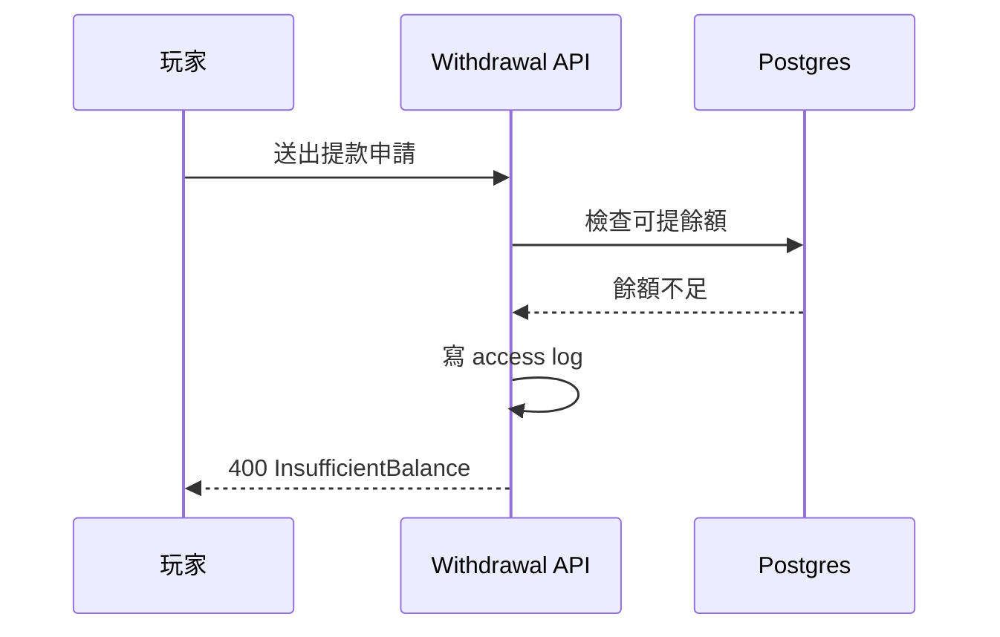

# kernel net10 升級：前置決策

依賴 **K-0** 的結論。~~原本打算連套件一起升~~ —— 已拆成第二階段。

## 現況

| repo | 專案 | 現況 TFM |
|---|---|:---:|
| kernel/common | `Data.Common.Context.Postgresql` | `net8.0` |
| kernel/api | `Api.Common` | `net6.0;net8.0` |
| kernel/monitoring | `Monitoring.Tracing` | `net6.0;net8.0` |

## 鏈路

## 檢查項目

- [x] 盤點 multi-target 的 repo
- [x] ~~確認 net6 consumer~~
- [ ] 決定 net6.0 的處置
- [ ] 確認 shared-library 有 net10 版本
